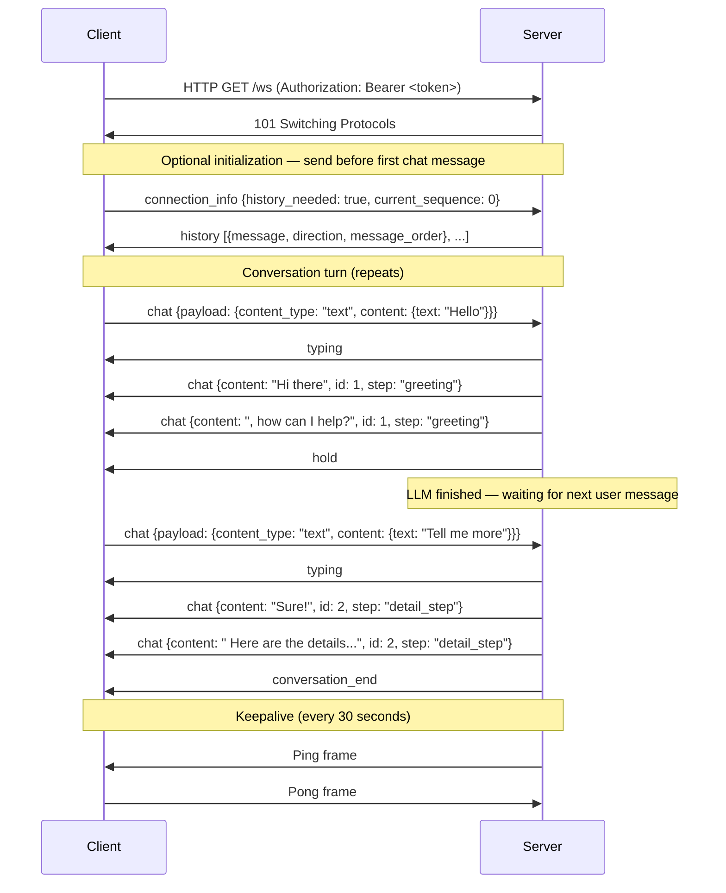
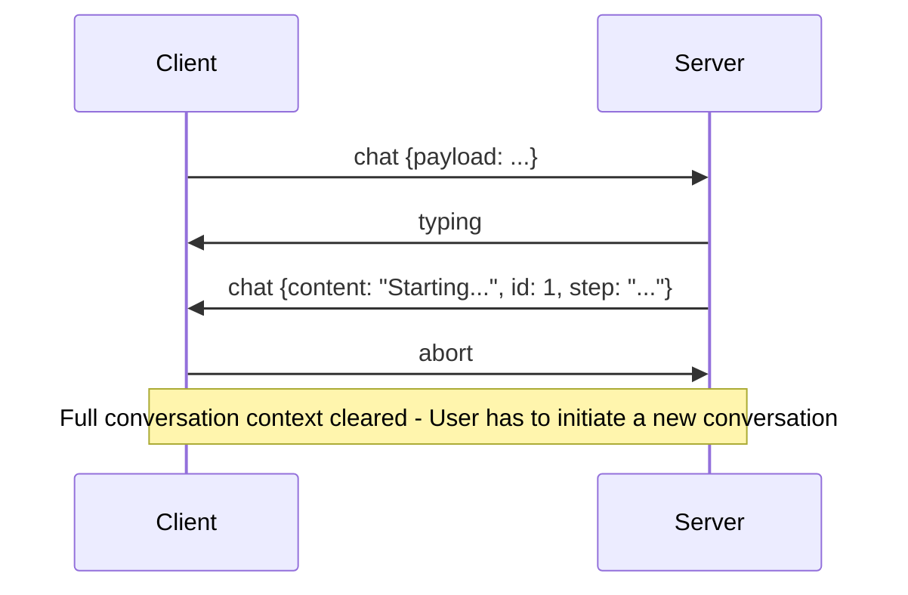
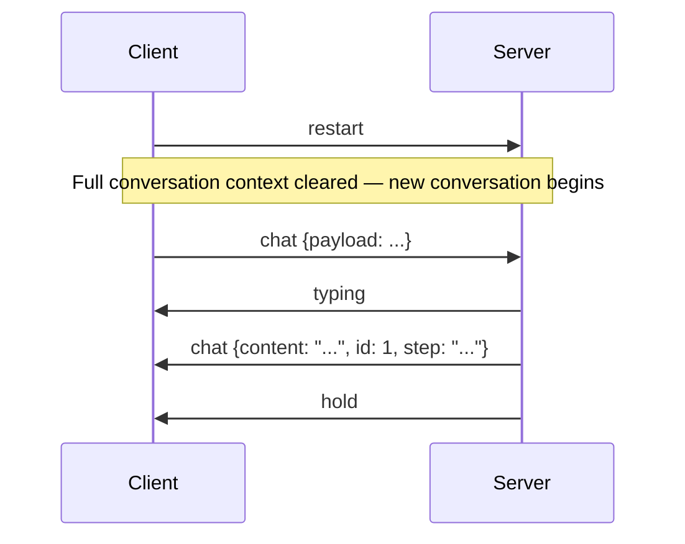
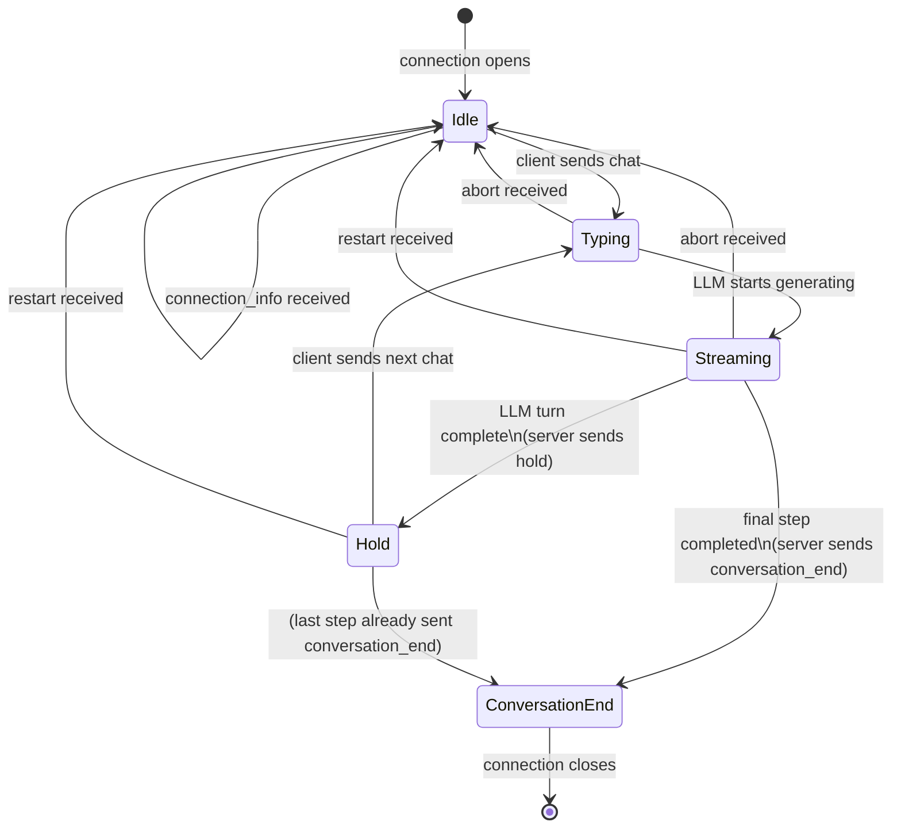

# Hikari Chat WebSocket API

Real-time, streaming chat with AI modules over WebSocket. The connection is stateful — messages from the server arrive asynchronously and interleave freely, so clients must be prepared to handle any message type at any time.

---

## Endpoints

| Endpoint                 | Path                                                      |
| ------------------------ | --------------------------------------------------------- |
| Module + Session         | `GET /api/v0/llm/chat/{module_id}/{session_id}/ws`        |
| Alternate (same handler) | `GET /api/v0/modules/{module}/sessions/{session}/chat/ws` |
| Self-learning mode       | `GET /api/v0/llm/chat/{module_id}/self-learning/ws`       |

**Path parameters:**

| Parameter                | Type   | Description                                    |
| ------------------------ | ------ | ---------------------------------------------- |
| `module_id` / `module`   | string | Module identifier                              |
| `session_id` / `session` | string | Session identifier (omitted for self-learning) |

These are standard HTTP GET requests that upgrade to WebSocket (RFC 6455). The URL is not a standalone `ws://` address — WebSocket clients must perform the HTTP upgrade.

---

## Authentication

Two methods are supported. The server validates an OIDC-based JWT on connection. Authentication failure rejects the WebSocket upgrade before the connection is established.

### Method 1 — Authorization header (preferred)

```
Authorization: Bearer <jwt_token>
```

Use this for server-side clients and native apps where headers can be set during the WebSocket handshake.

### Method 2 — Query parameter (for browsers)

```
/api/v0/llm/chat/{module_id}/{session_id}/ws?access_token=<jwt_token>
```

The browser-native `WebSocket` constructor does not support custom headers, so the token must be passed as a query parameter.

> **Security note:** Query parameter tokens appear in server access logs and browser history. Prefer header auth when your client supports it.

---

## Connection Lifecycle

### Sequence Diagram



### Abort flow



### Restart flow



### Phases

1. **Handshake** — HTTP upgrade + authentication. Rejected connections never reach the WebSocket phase.
2. **Initialization (optional)** — Send `connection_info` immediately after connecting to request prior conversation history. Must be sent before the first `chat` message if history is needed.
3. **Conversation** — Client sends `chat` messages; server streams the response as a sequence of `chat` chunks. When the LLM finishes a turn it sends `hold`, signaling it is ready for the next user message. The final turn ends with `conversation_end` instead of `hold`.
4. **Keepalive** — Server sends a `Ping` frame every 30 seconds. Most libraries handle `Pong` automatically. Low-level clients must respond explicitly.

---

## Server-side State Machine



**Key semantic:** `hold` means the LLM finished generating its response for the current turn and the conversation is paused, waiting for the client's next `chat` message. It is **not** an error or waiting-for-external-call state. After `hold`, send the next user message to continue.

---

## Message Format

All messages are JSON. Both directions use a **tagged union** with `type` and `value` fields at the top level:

```json
{"type": "<variant>", "value": <payload>}
```

Unit variants (no payload) omit the `value` field entirely:

```json
{ "type": "conversation_end" }
```

---

## Client → Server Messages

### Reference

| `type`            | `value`                              | Purpose                                    |
| ----------------- | ------------------------------------ | ------------------------------------------ |
| `chat`            | `{payload, metadata}`                | Send a user message                        |
| `connection_info` | `{history_needed, current_sequence}` | Request history on connect                 |
| `abort`           | _(none)_                             | Stop the current streaming response        |
| `restart`         | _(none)_                             | Clear conversation context and start fresh |

---

### `chat`

Send a user message to the AI.

```json
{
  "type": "chat",
  "value": {
    "payload": {
      "content_type": "text",
      "content": { "text": "Hello!" }
    },
    "metadata": {
      "time": "2026-04-28T12:00:00+00:00"
    }
  }
}
```

**`metadata.time`** — ISO 8601 timestamp of when the user sent the message. Always include it.

#### Payload content types

The `payload` field is itself a tagged union using `content_type` and `content`:

**Text** — plain user input

```json
{
  "content_type": "text",
  "content": { "text": "Hello!" }
}
```

---

### `connection_info`

Request conversation history on connect. Send this immediately after the WebSocket connection opens, before sending any `chat` message.

```json
{
  "type": "connection_info",
  "value": {
    "history_needed": true,
    "current_sequence": 0
  }
}
```

| Field              | Type         | Description                                                                                                 |
| ------------------ | ------------ | ----------------------------------------------------------------------------------------------------------- |
| `history_needed`   | boolean      | Set `true` to receive history messages                                                                      |
| `current_sequence` | number (u16) | Send `0` on first connect; send the last known sequence number on reconnect to receive only missed messages |

---

### `abort`

Clears the the current conversation. The conversation remains open and the client can initate a new conversation by sending a conversation info.

```json
{ "type": "abort" }
```

---

### `restart`

Clear the conversation context and start a fresh conversation. Similar to abort, but a new conversation is automatically initated.

```json
{ "type": "restart" }
```

---

## Server → Client Messages

### Reference

| `type`             | `value`                | When sent                                                        |
| ------------------ | ---------------------- | ---------------------------------------------------------------- |
| `chat`             | `{content, id, step}`  | Streaming response chunk                                         |
| `history`          | array of messages      | After `connection_info` request with `history_needed: true`      |
| `conversation_end` | _(none)_               | Response stream is complete                                      |
| `typing`           | _(none)_               | Server is generating a response                                  |
| `hold`             | _(none)_               | LLM finished its turn — waiting for the next user `chat` message |
| `error`            | `{error, status_code}` | An error occurred                                                |

---

### `chat`

A streaming chunk of the AI's text response.

```json
{
  "type": "chat",
  "value": {
    "content": "Hello, how can I",
    "id": 1,
    "step": "greeting_step"
  }
}
```

| Field     | Type         | Description                                                                            |
| --------- | ------------ | -------------------------------------------------------------------------------------- |
| `content` | string       | Partial text for this chunk                                                            |
| `id`      | number (i32) | Message sequence number — chunks with the same `id` belong to the same logical message |
| `step`    | string       | The conversation step that generated this chunk                                        |

> **Important:** Concatenate all `chat` chunks that share the same `id` to reconstruct the full message. Do **not** render each chunk as a separate message.

### `history`

Sent in response to a `connection_info` request with `history_needed: true`. Contains prior conversation messages.

```json
{
  "type": "history",
  "value": [
    {
      "message": { "content_type": "text", "content": { "text": "Hi" } },
      "direction": "SEND",
      "conversation_id": "uuid-here"
    }
  ]
}
```

---

### `conversation_end`

Signals that the current response is fully complete.

```json
{ "type": "conversation_end" }
```

This is the definitive signal that the AI has finished responding. Do not assume the response is complete just because `chat` chunks stop arriving — always wait for `conversation_end`.

---

### `typing`

The server is processing and generating a response. No action required.

```json
{ "type": "typing" }
```

---

### `hold`

The LLM has finished generating its response for the current turn. The conversation is now paused, waiting for the client to send the next `chat` message. This is the normal end-of-turn signal for all turns except the final one (which uses `conversation_end` instead).

```json
{ "type": "hold" }
```

> **Important:** After receiving `hold`, the conversation is still active. Send the next user `chat` message to continue. Do not close the connection.

---

### `error`

An application-level error occurred. **The connection is not closed.**

```json
{
  "type": "error",
  "value": {
    "error": "Agent not found",
    "status_code": 500
  }
}
```

---

## Error Handling

### WebSocket close codes

| Close Code | RFC Name       | Cause                                       | Client action                                          |
| ---------- | -------------- | ------------------------------------------- | ------------------------------------------------------ |
| `1002`     | Protocol Error | Client sent an invalid or malformed message | Fix the message format — do not retry the same message |
| `1011`     | Internal Error | Server-side failure                         | Reconnect with exponential backoff                     |

The close frame includes a human-readable reason string.

### Application-level errors vs. connection close

`{"type": "error"}` messages are delivered over the open WebSocket and do **not** close the connection. The client can continue sending messages.

WebSocket close frames (codes 1002, 1011) terminate the connection.

### Reconnection guidance

On unexpected close (any code other than `1000` Normal Closure), wait before reconnecting. A simple exponential backoff starting at 1 second works well. On `1002`, do not retry the exact same message that caused the close.

---

## Code Examples

### Browser JavaScript

Uses the native `WebSocket` API with `access_token` query parameter auth.

```javascript
const BASE_URL = "wss://your-hikari-server.example.com";
const token = "<your-jwt-token>";
const moduleId = "my-module";
const sessionId = "session-123";

const ws = new WebSocket(
  `${BASE_URL}/api/v0/llm/chat/${moduleId}/${sessionId}/ws?access_token=${token}`,
);

// Buffer streaming chunks by id
const chunks = {};

ws.addEventListener("open", () => {
  // Request history on connect
  ws.send(
    JSON.stringify({
      type: "connection_info",
      value: { history_needed: true, current_sequence: 0 },
    }),
  );
});

ws.addEventListener("message", (event) => {
  const msg = JSON.parse(event.data);

  switch (msg.type) {
    case "chat": {
      const { id, content } = msg.value;
      chunks[id] = (chunks[id] ?? "") + content;
      // Update UI with partial text: chunks[id]
      break;
    }
    case "conversation_end": {
      // Response is complete — unlock the input field
      console.log("Final messages:", chunks);
      break;
    }
    case "payload": {
      console.log("Structured payload:", msg.value);
      break;
    }
    case "history": {
      console.log("History:", msg.value);
      break;
    }
    case "typing":
    case "hold": {
      // Show loading indicator
      break;
    }
    case "error": {
      console.error("Server error:", msg.value.error, msg.value.status_code);
      break;
    }
  }
});

ws.addEventListener("close", (event) => {
  console.log("Connection closed", event.code, event.reason);
});

// Send a text message
function sendMessage(text) {
  ws.send(
    JSON.stringify({
      type: "chat",
      value: {
        payload: {
          content_type: "text",
          content: { text },
        },
        metadata: {
          time: new Date().toISOString(),
        },
      },
    }),
  );
}
```

---

### Python (AI agent)

Uses the `websockets` library with header-based auth. Suited for server-side agents.

```python
import asyncio
import json
from datetime import datetime, timezone
import websockets

BASE_URL = "wss://your-hikari-server.example.com"
TOKEN = "<your-jwt-token>"
MODULE_ID = "my-module"
SESSION_ID = "session-123"


async def chat(user_message: str) -> str:
    uri = f"{BASE_URL}/api/v0/llm/chat/{MODULE_ID}/{SESSION_ID}/ws"
    headers = {"Authorization": f"Bearer {TOKEN}"}

    async with websockets.connect(uri, additional_headers=headers) as ws:
        # Request history (optional)
        await ws.send(json.dumps({
            "type": "connection_info",
            "value": {"history_needed": False, "current_sequence": 0}
        }))

        # Send user message
        await ws.send(json.dumps({
            "type": "chat",
            "value": {
                "payload": {
                    "content_type": "text",
                    "content": {"text": user_message}
                },
                "metadata": {
                    "time": datetime.now(timezone.utc).isoformat()
                }
            }
        }))

        # Collect streaming response
        chunks: dict[int, str] = {}

        async for raw in ws:
            msg = json.loads(raw)

            match msg["type"]:
                case "chat":
                    v = msg["value"]
                    chunks[v["id"]] = chunks.get(v["id"], "") + v["content"]

                case "conversation_end":
                    # Reassemble in order
                    full_response = "".join(chunks[k] for k in sorted(chunks))
                    return full_response

                case "payload":
                    # Handle structured responses alongside text
                    print("Payload:", msg["value"])

                case "error":
                    raise RuntimeError(
                        f"Server error {msg['value']['status_code']}: {msg['value']['error']}"
                    )

    return ""


asyncio.run(chat("Hello!"))
```

---

### TypeScript / Node.js

Uses the `ws` library with header auth and basic reconnection logic.

```typescript
import WebSocket from "ws";

const BASE_URL = "wss://your-hikari-server.example.com";
const TOKEN = "<your-jwt-token>";
const MODULE_ID = "my-module";
const SESSION_ID = "session-123";

type ServerMessage =
  | { type: "chat"; value: { content: string; id: number; step: string } }
  | { type: "payload"; value: unknown }
  | { type: "history"; value: unknown[] }
  | { type: "conversation_end" }
  | { type: "typing" }
  | { type: "hold" }
  | { type: "error"; value: { error: string; status_code: number } };

function connect(): Promise<string> {
  return new Promise((resolve, reject) => {
    const url = `${BASE_URL}/api/v0/llm/chat/${MODULE_ID}/${SESSION_ID}/ws`;
    const ws = new WebSocket(url, {
      headers: { Authorization: `Bearer ${TOKEN}` },
    });

    const chunks: Record<number, string> = {};
    let retryDelay = 1000;

    ws.on("open", () => {
      retryDelay = 1000;

      ws.send(
        JSON.stringify({
          type: "connection_info",
          value: { history_needed: false, current_sequence: 0 },
        }),
      );

      ws.send(
        JSON.stringify({
          type: "chat",
          value: {
            payload: { content_type: "text", content: { text: "Hello!" } },
            metadata: { time: new Date().toISOString() },
          },
        }),
      );
    });

    ws.on("message", (raw: Buffer) => {
      const msg = JSON.parse(raw.toString()) as ServerMessage;

      switch (msg.type) {
        case "chat": {
          const { id, content } = msg.value;
          chunks[id] = (chunks[id] ?? "") + content;
          break;
        }
        case "conversation_end": {
          const response = Object.keys(chunks)
            .map(Number)
            .sort((a, b) => a - b)
            .map((k) => chunks[k])
            .join("");
          ws.close();
          resolve(response);
          break;
        }
        case "error": {
          ws.close();
          reject(new Error(`${msg.value.status_code}: ${msg.value.error}`));
          break;
        }
      }
    });

    ws.on("close", (code) => {
      if (code !== 1000) {
        // Unexpected close — retry with backoff
        console.warn(`WebSocket closed (${code}), retrying in ${retryDelay}ms`);
        setTimeout(() => connect().then(resolve).catch(reject), retryDelay);
        retryDelay = Math.min(retryDelay * 2, 30_000);
      }
    });

    ws.on("error", (err) => {
      console.error("WebSocket error:", err);
    });
  });
}

connect().then(console.log);
```

---

## Notes

There is only one parallel chat possible for a given session. To start a new conversation, use restart or abort and start a new connection.
